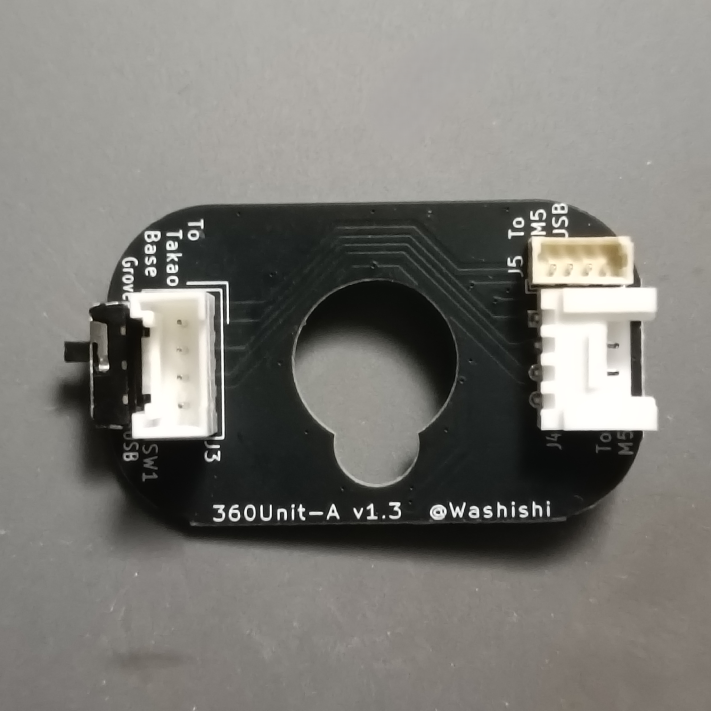
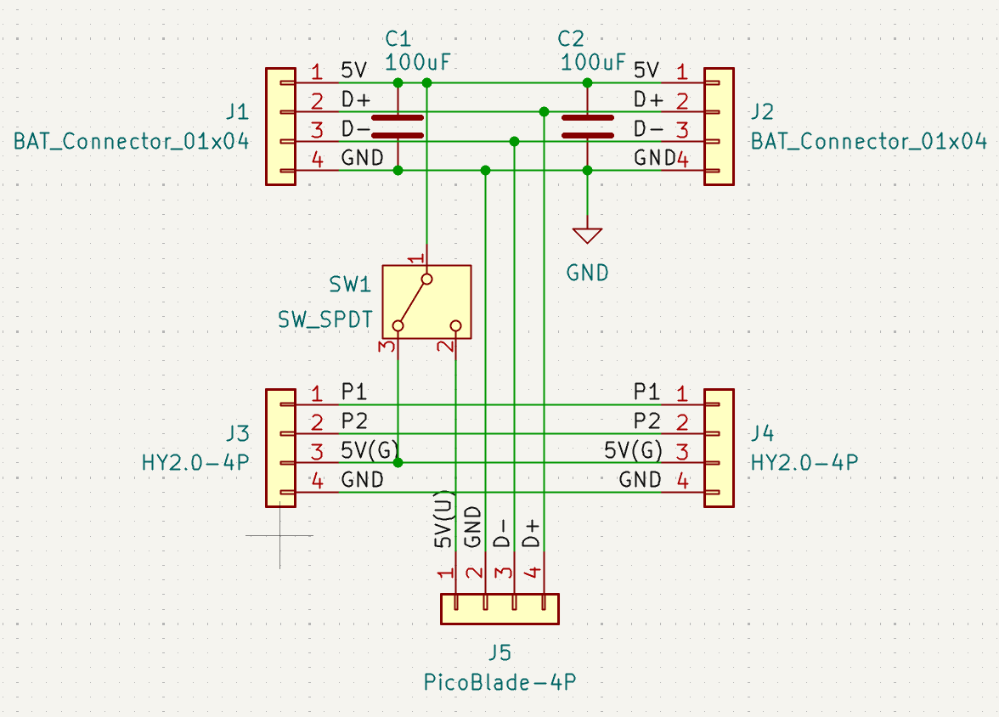
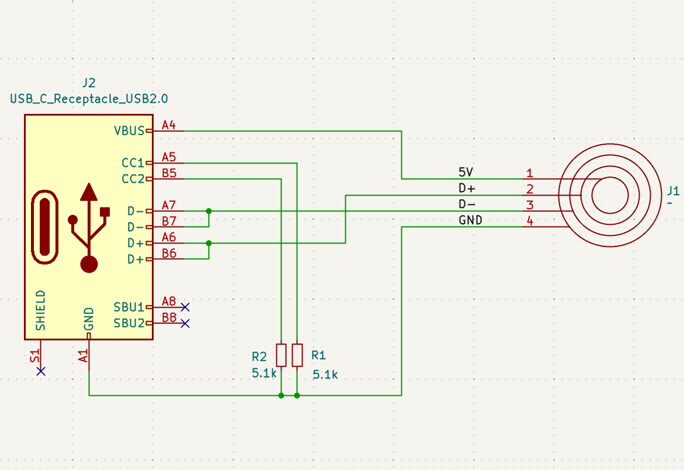
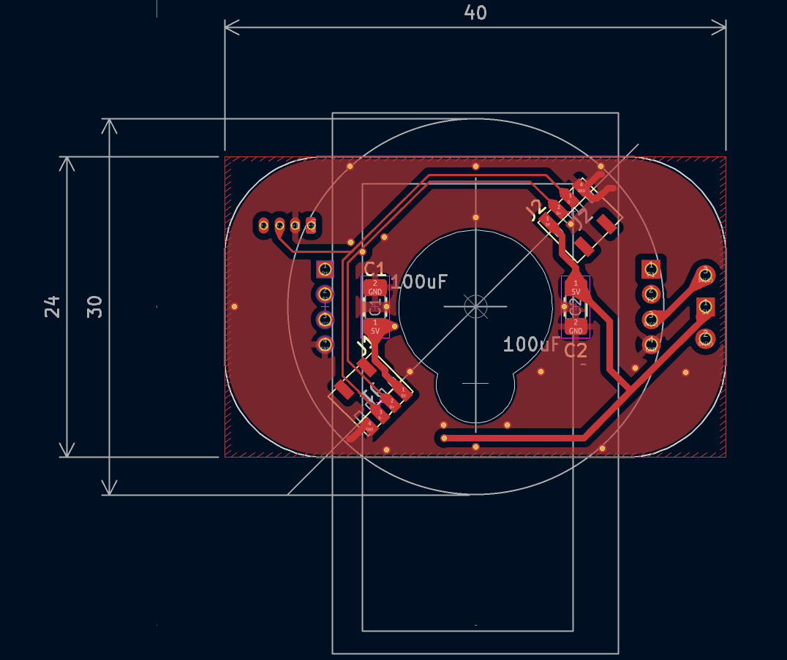
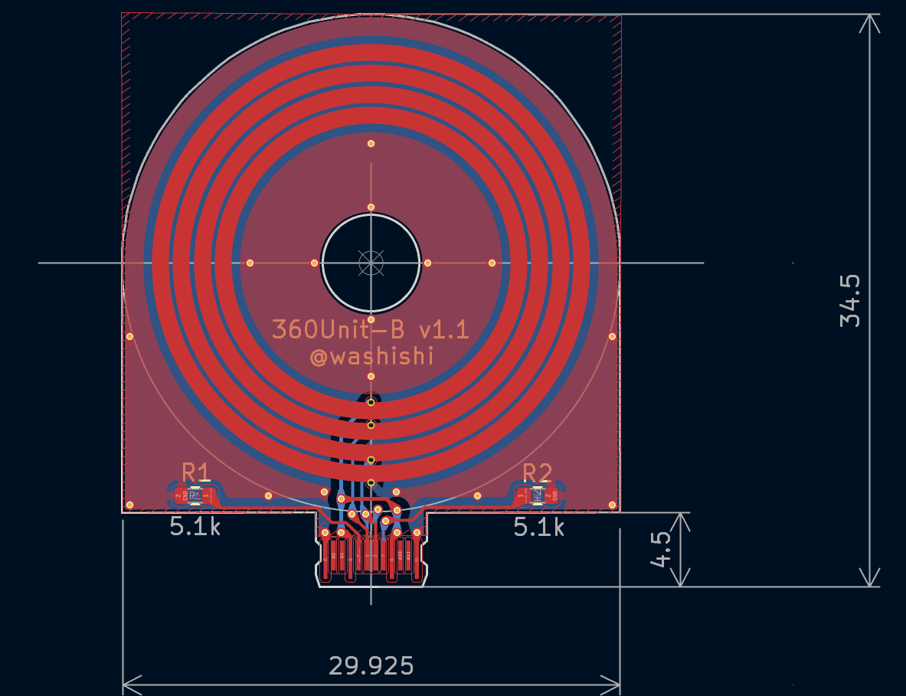

# stack-chan_360unit
Rotation unit for Takao's SCS0009 version stack chan

## 説明
-  タカヲ([@mongonta555](https://x.com/mongonta555))さんの [SCS0009サーボ専用 ｽﾀｯｸﾁｬﾝ](https://raspberrypi.mongonta.com/about-products-stackchan-m5gobottom-version/) を回転させてもUSBケーブルが邪魔にならないようにするユニットです
- [【SCS0009専用】ｽﾀｯｸﾁｬﾝ タカオ版 ケースセット](https://mongonta.booth.pm/items/5186064)に後付けできます
-  M5Coreへの電源供給は Groveポート経由、USBコネクタ経由(外部/内部)いずれかで行うことができます  
-  USBコネクタに接続した場合は電源の供給だけでなくデータ通信も行うことができます
  
 
 

## BOOTHで頒布するセットの説明
BOOTHで頒布する[タカヲ版 SCS0009 ｽﾀｯｸﾁｬﾝ用 360ユニット セット](https://washishi.booth.pm/items/7204147)は下記のセットとなっています
 
1. 360ユニット 基板A  
   電源等を伝達するための基板です  
   GroveおよびUSB接続用のコネクタ、電源供給先切替用のスイッチが付いています
2. 360ユニット 基板B  
   電源元のUSBからの受電部です ここにACアダプタ等を接続します(同時に他の場所等の2か所から給電しないでください)  
   USB Type-C コネクタ部分は スーザン＠子育てエンジニア([@suzan_works](https://x.com/suzan_works)
)さんの  
[プリント基板製USB-Cコネクタ](https://suzan-works.booth.pm/items/6574802)の[設計データ](https://github.com/suzan-works/USB-C_PCB_Receptacle)を利用させてもらっています

3. サーボ用スペーサー
   360Unitの接点の入る厚みを確保するために足側のサーボとブラケットの間に挟みます  
4. USB(外部)用ケーブル  
   M5CoreのUSB Type-C 端子と接続する場合に利用するケーブルです  
   LLMモジュールを付けている場合はそちらのUSB Type-C端子に接続することもできます  
   結線はCore内部の表記と同じで下記となります  
    1.+5V(赤)  
    2.GND(黒)  
    3.D-(DM) (黄)  
    4.D+(DP) (緑)  
5. USB(内部)用ケーブル  
   Core2 や CoreS3※,S3SE,S3Lite 等の内部にある1.25mmピッチのUSBコネクタと接続する場合に利用するケーブルです  
   コネクタ同士の結線はストレート(同じピン同士が接続)です  
   ※CoreS3の初期ロット？にはこのコネクタが実装されていない様です
6. Groveケーブル 10cm  
   GroveコネクタからM5Coreに給電する際に360ユニットとCoreのGrove端子を接続するケーブルです   
7. 1.25mmピッチコネクタ  
   CoreS3の初期ロット？では内部USBコネクタが未実装の様なので自分で実装する場合の為に1つ添付しています・・・がCoreS3の分解は難易度が高い為自信がない場合は行わない方がいいです(分解方法についてもここでは解説しません)
## 組み立て方
1. 利用する工具等
   - ドライバ　または 六角レンチ  
     ｽﾀｯｸﾁｬﾝの足(サーボホーン)とサーボの固定ネジの取り外し/取り付けに利用します  
     利用しているネジに合ったものを準備してください
   - やすり  
     サーボホーンがガタつくときや360ユニット基板Bがはめにくい場合に使う場合があります(100均のダイヤモンドやすりでかまいません)
   - ニッパー  
     サーボ用スペーサーを切って取り付ける場合は利用します
   - ピンセット  
     コネクタを刺す際にあると便利です

2. すでにｽﾀｯｸﾁｬﾝが組みあがっている場合は正面を向いた状態(サーボが中点)で停止します  
   新規で組み立てる場合も位置を動かしてしまっている場合は中点に合わせてください
3. ｽﾀｯｸﾁｬﾝの足(サーボホーン)のネジを外して取り外します  
   サーボホーンを乗せた状態でガタつかず水平になることを確認します  
   ガタつく場合はサーボホーンの側面(下記写真の赤色部分)を少しやすりで削って足の固定部分と干渉しないようにします  
     
4. 360ユニット 基板B を写真の向きで足にはめます  
   窪みに合わせてサーボホーンに当たるまで押し込みます  
   はめにくい場合は基板の側面をやすりで少し削ってください  
   
5. サーボの固定ネジ(2本)を取り外しサーボとブラケットの間にスペーサーを入れて再度固定ネジで止めます  
   組みあがった状態だとサーボのケーブルを一度外す必要があり面倒なので写真のようにスペーサーをニッパーでカットしてしまってもいいです  
  
  

6. 360ユニット 基板Aを写真の向きでサーボにはめてからｽﾀｯｸﾁｬﾝの足を再度取り付けます  

 
※足をねじ止めする前に次の「7.配線」を行った方が配線がしやすいかもしれません

7. 配線  
   コネクタ同士の配線を行います

   以下の接続ができます  
   - USB(外部)給電 (CoreのUSBコネクタから給電)
   - USB(内部)給電 (Core2,S3系(※)の内部USBコネクタから給電) 
   - Grove給電 (CoreやGoBottomのGroveポートから給電)  
    
    接続方法  
      |給電|接続方法|スイッチ|データ  通信|  
    |:-|:--|:--|:-:| 
    |USB (外部)|「To M5 USB」と M5Core のUSBコネクタを「USB(外部)用ケーブル」で繋ぎます|USB側|可|  
    |USB (内部)|「To M5 USB」と M5Core2,S3系(※)の内部USBコネクタを「USB(内部)用ケーブル」で繋ぎます|USB側|可|  
    |Grove|M5CoreやGOBottomのGroveポートを「GROVEケーブル」で「To M5」のGroveポート(横)と繋ぎます、TakaoBASEは「To TakaoBase」のGroveポート(縦)に繋ぎます|Grove側|不可|  

   - USBとGroveの両方の配線を行ってもスイッチで切替となるので問題ありません  
   - ※CoreS3の初期ロット？では内部USBコネクタが実装されていません  
 
  
USB(内部)コネクタ(左写真)、USB(内部)コネクタ利用でLLMモジュールを付ける場合はLLMモジュールの基板下に少し隙間があるので一度基板を止めているネジを外して通してください(右写真)  
 

配線の完了で作業は完了です  

## 使い方
ｽﾀｯｸﾁｬﾝの足の後ろに飛び出しているUSB Type-CコネクタにACアダプタやPCを接続して給電します  
CoreとUSBケーブル(外部/内部)で接続している場合はPCと繋ぐとプログラム書き込み等のデータ通信も行えます  

## 基板制作データ等
 
 

本リポジトリ schematics の配下に kicad (v9)で作成した回路図、基板データ一式があります  
また schematics/production 配下には基板発注に利用するガーバデータのzipファイルもあります

## BOM(部品リスト)
|名称|仕様|メーカー|個数|備考|備考購入先|  
|:--|:--|:-:|:-:|:--|:--|  
|基板|stack-chan 360Unit A基板|-|1||[JLCPCB](https://jlcpcb.com/JPV)へ発注|
|基板|stack-chan 360Unit B基板|-|1||[JLCPCB](https://jlcpcb.com/JPV)へ発注|
|チップ抵抗|5.1KΩ 1608サイズ|-|2||[秋月電子](https://akizukidenshi.com/catalog/g/g130338/)100個セット|
|チップ積層セラミックコンデンサ|100uF 10V 3216サイズ|-|1||[秋月電子](https://akizukidenshi.com/catalog/g/g115633/)10個セット|
|スイッチ|2.5mmピッチ SPDT サイド型|-|1||[秋月電子](https://akizukidenshi.com/catalog/g/g115370/)|
|Groveコネクタ|HY2.0-4P ストレート|-|1||[秋月電子](https://akizukidenshi.com/catalog/g/g131074/)10個セット|
|Groveコネクタ|HY2.0-4P L形|-|1||[秋月電子](https://akizukidenshi.com/catalog/g/g112634/)10個セット|
|1.25mmコネクタ ケーブルセット|4P 10cm 片側のみコネクタ圧着|-|2|ケーブル1  コネクタ2|[Aliexpress](https://ja.aliexpress.com/item/1005006003135511.html)10ペア セット||
|1.25mmコネクタ ケーブル|4P ストレート 100mm 両側コネクタ|-|1||[Aliexpress](https://ja.aliexpress.com/item/1005005898168919.html)10個セット||
|USB Type-Cコネクタ|MX-12とあるもの|-|1||[Aliexpress](https://ja.aliexpress.com/item/1005007581371610.html)||
|バッテリー端子|smd 1.27mmピッチ 4P|-|2|ばね接点|[Aliexpress](https://ja.aliexpress.com/item/1005005302903409.html)5個セット||
|シリコンチューブ|内径2mm外形3mm|-|6cmほど|USB(外部)ケーブルに被せてます|[Aliexpress](https://ja.aliexpress.com/item/1005001499980646.html)1m||

## 3Dモデル等
3D_Model 配下に 下記の利用した3Dモデルデータ(STEP,STL形式)があります
 - サーボスペーサ
 - USB Type-C コネクタケース 上部
 - USB Type-C コネクタケース 下部  
